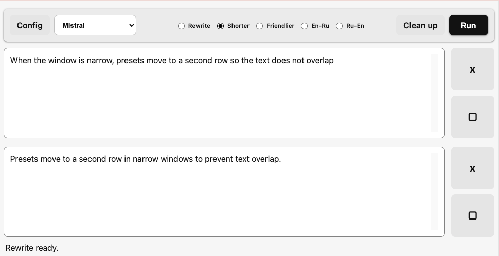

# Local Rewrite Tool

A small local web app for rewriting pasted text with configurable AI providers.


## Setup

1. Install dependencies:

   ```sh
   npm install
   ```

2. Create a `.env` file in this folder:

   ```sh
   cp .env.example .env
   ```

3. Open `.env` and add the API key for any provider you want to use.

You can also edit provider keys from the app's `config` panel. Provider edits are saved in `providers.json`, which is local to this folder and ignored by git.

## Run

```sh
npm run app:run
```

This starts the local server in the foreground. Keep that terminal open while using the app.

Then open:

```txt
http://127.0.0.1:3000
```

To stop or restart the local server:

```sh
npm run app:stop
npm run app:restart
```

## Use

- Paste text into the input field.
- Choose one of the five preset rewrite instructions.
- Click `config` to edit each preset name and prompt text.
- Choose a provider in the provider list. Cerebras, Mistral, Cohere, Groq, and Cloudflare are available by default.
- Use the model dropdown inside a provider section to enter model names manually.
- Paste the provider API key in its section and save it locally.
- For Cloudflare, enter your Cloudflare Account ID too. Cloudflare has five manual model slots.
- Click `run`.
- Copy the rewritten result from the output field.
- Review the last-request usage panel when the provider returns token usage or rate-limit headers.

The app does not save rewrite history. API keys are saved locally on the server and are not sent back to the browser.

## Providers

| Provider | Official site | Notes |
| --- | --- | --- |
| Cerebras | [Cerebras Cloud](https://cloud.cerebras.ai/) | Uses an OpenAI-compatible chat completions API. |
| Mistral | [Mistral AI Studio](https://console.mistral.ai/home) | Uses the Mistral API with manually configured model names. |
| Cohere | [Cohere](https://cohere.com/) | Uses Cohere's OpenAI-compatible API. |
| Groq | [GroqCloud](https://console.groq.com/home) | Uses Groq's OpenAI-compatible API. |
| Cloudflare | [Cloudflare Workers AI](https://developers.cloudflare.com/workers-ai/) | Requires both an API token and Cloudflare Account ID. |

Provider API keys and Cloudflare Account ID are stored only in local config files on this machine.
